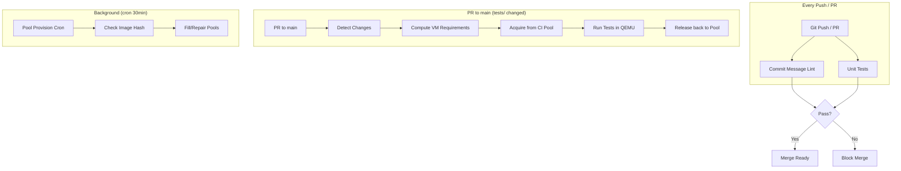
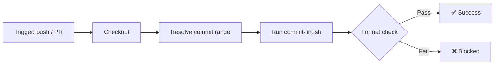
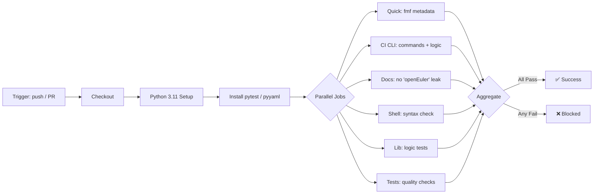
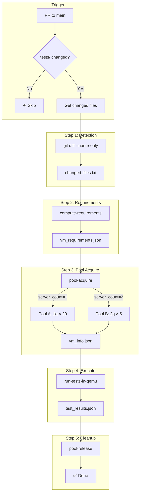
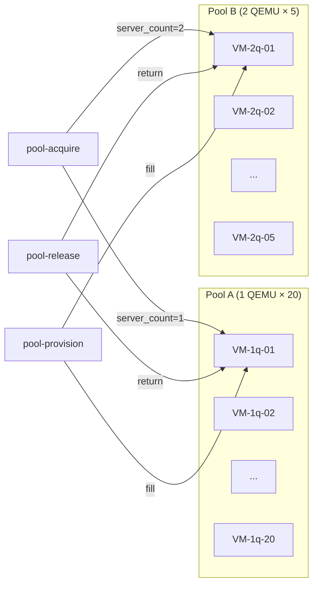
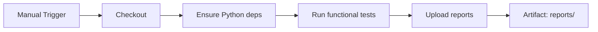
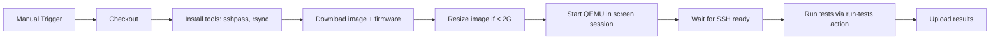
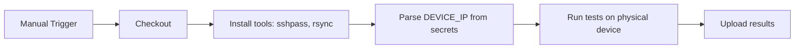
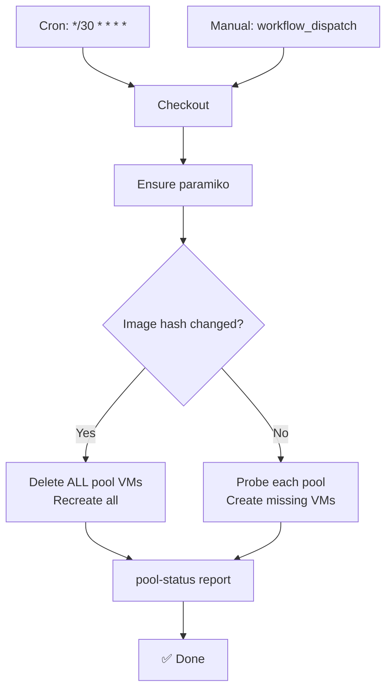
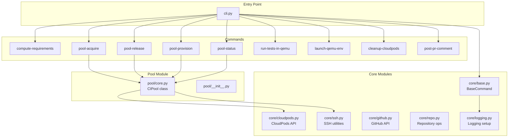

# CI Guide

This document describes the CI/CD workflows and checkpoints used in openruyi-autotest, including the architecture of the persistent CI pool and the test execution pipeline.

---

## 1. Overview

| Workflow | Trigger | Runner | Description |
|----------|---------|--------|-------------|
| **Commit Message Lint** | Every push / PR | `ubuntu-latest` | Validates commit messages follow [Conventional Commits](commit_guide.md) |
| **Unit Tests** | Every push / PR | `ubuntu-latest` | fmf metadata, CI CLI logic, shell syntax, docs lint |
| **PR Tests Changed Verification** | PR to `main` with `tests/` changes | `self-hosted` | Detects changed tests, acquires a VM from the CI pool, runs tests in QEMU, releases back to pool |
| **CI Pool Provision** | Cron (every 30 min) / Manual | `self-hosted` | Idempotent pool fill — checks image hash, creates missing VMs |
| **Functional Tests** | Manual (`workflow_dispatch`) | `self-hosted` | Full functional test suite (281 suites) |
| **QEMU RISC-V Test** | Manual (`workflow_dispatch`) | `self-hosted` | Tests on RISC-V QEMU emulation |
| **Device Test** | Manual (`workflow_dispatch`) | `self-hosted` | Tests on physical RISC-V device |

---

## 2. Auto-Run Workflows

### 2.1 Commit Message Lint

**Trigger:** Every `push` and `pull_request` on any branch.

**Checkpoints:**

| # | Rule | Example (✅ Correct) | Example (❌ Wrong) |
|---|------|---------------------|-------------------|
| 1 | Format: `<type>(<scope>): 
` | `fix(ci): support format args` | `fixed ci bug` |
| 2 | ASCII English only | `feat: add new test` | `feat: 添加新测试` |
| 3 | Summary lowercase start | `fix: correct assertion` | `fix: Correct assertion` |
| 4 | Summary ≤ 72 chars | `chore: update deps` | `chore: update dependencies to the latest version available` |
| 5 | No trailing period | `docs: add guide` | `docs: add guide.` |

> See [Commit Guide](commit_guide.md) for the full specification.

### 2.2 Unit Tests

**Trigger:** Every `push` and `pull_request` on any branch.

**Checkpoints:**

| Job | What It Checks |
|-----|---------------|
| `quick` | FMF metadata correctness (`.fmf/version`, plans, test structure) |
| `ci-cli` | CI CLI command registry, argument parsing, cloudpods/ssh/github modules |
| `docs-lint` | No `openEuler` references in `docs/` (compliance) |
| `shell-syntax` | All `.sh` scripts syntax-valid (bash -n) |
| `lib-logic` | `tests/lib/` helper functions logic |
| `tests-quality` | Test case quality: BeakerLib `rlJournalPrintText` usage, metadata integrity |

---

## 3. PR Tests Changed Verification

This is the core CI pipeline for PR review. It runs **only** when a PR targets `main` and has changes under `tests/`.

**Checkpoints:**

| Checkpoint | What It Validates |
|-----------|------------------|
| `changed_files.txt` | File list non-empty; paths under `tests/` |
| `vm_requirements.json` | `server_count` (1 or 2), `packages`, `reason` |
| Pool acquire | SSH reachable within 600s timeout; valid `vm_info.json` with host_ip + qemu_ports |
| Test execution | All BeakerLib test scripts return pass/fail; `test_results.json` generated |
| Pool release | VM returned to pool (not deleted); `pool-release` always runs (`if: always()`) |

### 3.1 CI Pool Architecture

| Pool | SKU | QEMU per VM | Max Count | Prefix |
|------|-----|------------|-----------|--------|
| A | `ecs.g1.c8m8` | 1 | 20 | `openruyi-ci-pool-1q` |
| B | `ecs.g1.c16m16` | 2 | 5 | `openruyi-ci-pool-2q` |

**Pool behaviors:**

- **Image hash check:** Before provisioning, compares current CloudPods image hash with stored hash. If mismatch → delete ALL pool VMs and recreate.
- **Provisioning:** Cron every 30 minutes idempotently fills both pools to target capacity.
- **Acquire:** Finds a healthy VM (SSH reachable), reserves it, returns `vm_info.json`.
- **Release:** Returns VM to pool (SSH-probe confirms it's still healthy).
- **Dual pool routing:** `server_count=1` → Pool A; `server_count=2` → Pool B.

---

## 4. Manual Workflows

### 4.1 Functional Tests

**Parameters:** `suite` (comma-separated, empty = all), `no_cleanup` (keep VMs for debugging).

### 4.2 QEMU RISC-V Test

### 4.3 Device Test (Physical)

---

## 5. Pool Provision (Background)

**Checkpoints:**

| Checkpoint | Action |
|-----------|--------|
| Image hash mismatch | Delete all existing pool VMs → full rebuild |
| Pool A < 20 | Create missing VMs with SKU `ecs.g1.c8m8` |
| Pool B < 5 | Create missing VMs with SKU `ecs.g1.c16m16` |
| SSH probe | Each VM checked for reachability before marking healthy |

---

## 6. CI Scripts Architecture

| Module | Role |
|--------|------|
| `cli.py` | Main CLI entry; registers all commands via `CommandRegistry` |
| `core/base.py` | `BaseCommand` with `log_info`/`log_warn`/`log_error`, arg parsing, `execute()` |
| `core/cloudpods.py` | CloudPods REST API wrapper (`launch_env`, `delete_server`, `list_servers`, etc.) |
| `core/ssh.py` | SSH connection, file transfer, remote execution |
| `core/github.py` | GitHub API wrapper (PR info, comments, checks) |
| `core/repo.py` | Repository operations (tarball packaging, path resolution) |
| `pool/core.py` | `CIPool` class with `acquire`/`release`/`delete_all`/`probe_all` |

---

## 7. Quick Reference

### PR Workflow Checkpoints

| Step | Check | Pass Condition |
|------|-------|---------------|
| Commit Lint | Format, ASCII, lowercase, length | All commits in range pass |
| Unit Tests | 6 parallel jobs | All 6 pass |
| Changed Files | `git diff` under `tests/` | Non-empty → proceed |
| VM Requirements | `compute-requirements` output | Valid JSON with `server_count` |
| Pool Acquire | `pool-acquire --timeout 600` | SSH reachable within timeout |
| Test Execution | `run-tests-in-qemu` | All test scripts pass |
| Pool Release | `pool-release` (always runs) | VM returned to pool |

### Common Issues

| Symptom | Likely Cause | Action |
|---------|-------------|--------|
| Commit Lint failure | Non-ASCII or wrong format | Amend commit message per [Commit Guide](commit_guide.md) |
| Pool acquire timeout | Pool empty or VM unreachable | Trigger `pool-provision` manually or wait for cron |
| Test execution failure | Test script bug | Check `run_tests.log` in workflow artifacts |
| Job stuck queued | Self-hosted runner offline | Check runner status on `10.20.238.253` |