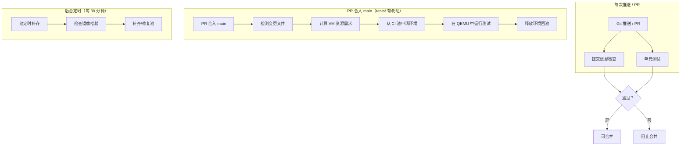
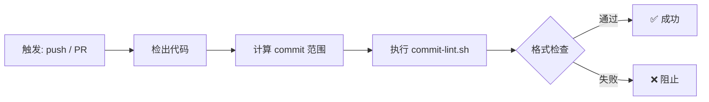
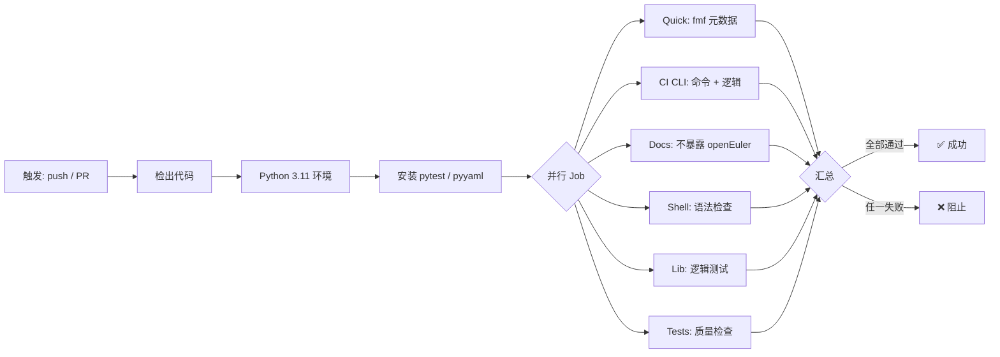
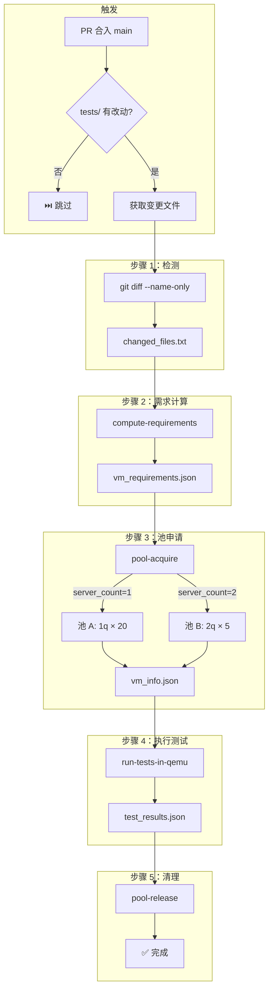
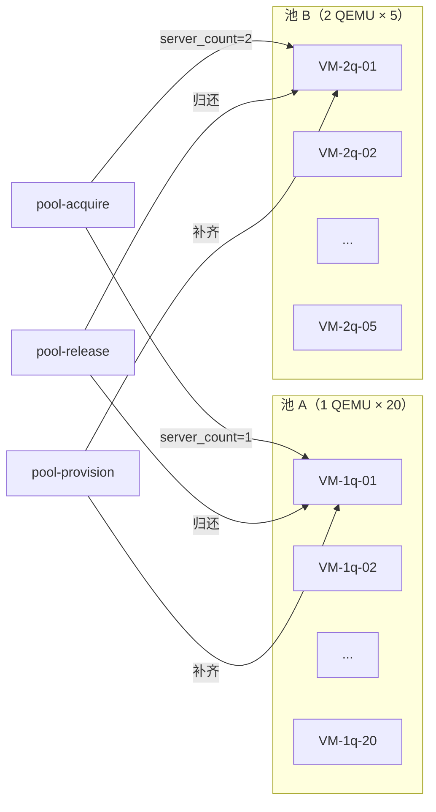
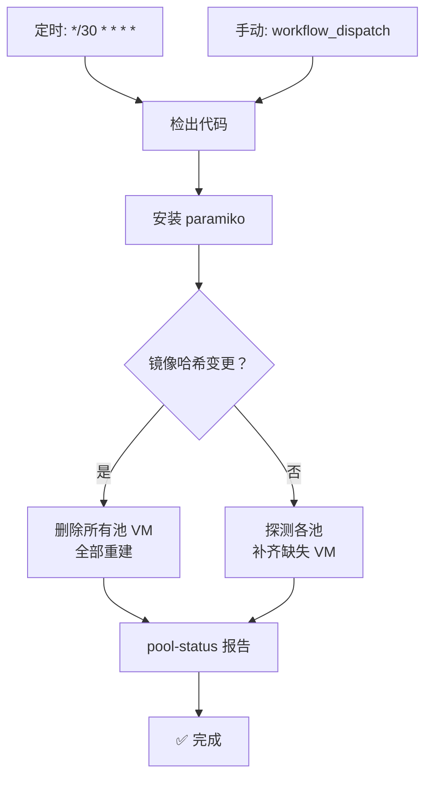
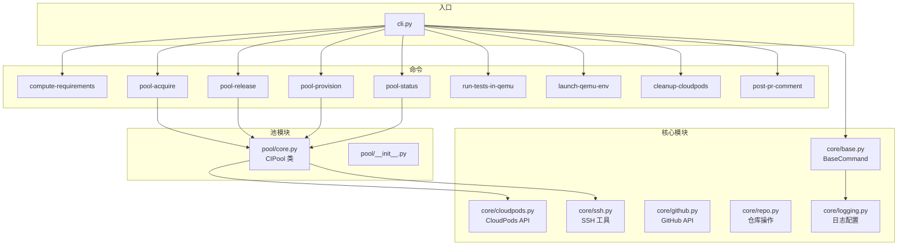

# CI 指南

本文档介绍 openruyi-autotest 中使用的 CI/CD 工作流和检查点，包括 CI 预置池架构和测试执行流水线。

---

## 1. 概述

| 工作流 | 触发条件 | 运行器 | 说明 |
|----------|---------|--------|-------------|
| **提交信息检查** | 每次推送 / PR | `ubuntu-latest` | 验证提交信息符合 [约定式提交](commit_guide_zh.md) |
| **单元测试** | 每次推送 / PR | `ubuntu-latest` | fmf 元数据、CI CLI 逻辑、Shell 语法、文档检查 |
| **PR 测试变更验证** | PR 合入 `main` 且 `tests/` 有改动 | `self-hosted` | 检测变更测试，从 CI 预置池获取 VM，在 QEMU 中执行测试，释放回池 |
| **CI 预置池补齐** | 定时（每 30 分钟）/ 手动 | `self-hosted` | 幂等填补双池至目标容量 |
| **Functional 全量测试** | 手动触发 | `self-hosted` | 全量 functional 测试套（281 套） |
| **QEMU RISC-V 测试** | 手动触发 | `self-hosted` | RISC-V QEMU 仿真测试 |
| **物理设备测试** | 手动触发 | `self-hosted` | RISC-V 真机测试 |

---

## 2. 自动运行的工作流

### 2.1 提交信息检查

**触发条件：** 任意分支的 `push` 和 `pull_request`。

**检查点：**

| # | 规则 | 示例（✅ 正确） | 示例（❌ 错误） |
|---|------|---------------------|-------------------|
| 1 | 格式：`<type>(<scope>): 
` | `fix(ci): support format args` | `fixed ci bug` |
| 2 | 仅限 ASCII 英文 | `feat: add new test` | `feat: 添加新测试` |
| 3 | 摘要以小写字母开头 | `fix: correct assertion` | `fix: Correct assertion` |
| 4 | 摘要 ≤ 72 字符 | `chore: update deps` | `chore: update dependencies to the latest version available` |
| 5 | 不以句号结尾 | `docs: add guide` | `docs: add guide.` |

> 完整规范参见 [提交指南](commit_guide_zh.md)。

### 2.2 单元测试

**触发条件：** 任意分支的 `push` 和 `pull_request`。

**检查点：**

| Job | 检查内容 |
|-----|---------------|
| `quick` | FMF 元数据正确性（`.fmf/version`、plans、测试结构） |
| `ci-cli` | CI CLI 命令注册、参数解析、cloudpods/ssh/github 模块 |
| `docs-lint` | `docs/` 中无不出现 `openEuler`（合规要求） |
| `shell-syntax` | 所有 `.sh` 脚本语法检查（bash -n） |
| `lib-logic` | `tests/lib/` 辅助函数逻辑 |
| `tests-quality` | 测试用例质量：BeakerLib `rlJournalPrintText` 使用、元数据完整性 |

---

## 3. PR 测试变更验证

这是 PR 审查的核心 CI 流水线。**仅当** PR 目标为 `main` 且 `tests/` 下有变更时运行。

**检查点：**

| 检查点 | 验证内容 |
|-----------|------------------|
| `changed_files.txt` | 文件列表非空；路径均在 `tests/` 下 |
| `vm_requirements.json` | `server_count`（1 或 2）、`packages`、`reason` |
| 池申请 | 600s 超时内 SSH 可达；生成有效的 `vm_info.json`（含 host_ip + qemu_ports） |
| 测试执行 | 所有 BeakerLib 测试脚本返回通过/失败；生成 `test_results.json` |
| 池释放 | VM 归还池中（不删除）；`pool-release` 总是执行（`if: always()`） |

### 3.1 CI 预置池架构

| 池 | 规格 | 每 VM QEMU 数 | 最大数量 | 前缀 |
|------|-----|------------|-----------|--------|
| A | `ecs.g1.c8m8` | 1 | 20 | `openruyi-ci-pool-1q` |
| B | `ecs.g1.c16m16` | 2 | 5 | `openruyi-ci-pool-2q` |

**池行为：**

- **镜像哈希检查：** 预置前比较当前 CloudPods 镜像哈希与存储的哈希。若不匹配 → 删除所有池 VM 并重建。
- **定时补齐：** 每 30 分钟幂等地将双池填补至目标容量。
- **申请：** 查找健康的 VM（SSH 可达），预留它，返回 `vm_info.json`。
- **释放：** 将 VM 归还池中（SSH 探测确认仍健康）。
- **双池路由：** `server_count=1` → 池 A；`server_count=2` → 池 B。

---

## 4. 手动触发的工作流

### 4.1 Functional 全量测试

**参数：** `suite`（逗号分隔，留空=全部），`no_cleanup`（保留 VM 用于调试）。

### 4.2 QEMU RISC-V 测试

### 4.3 物理设备测试

---

## 5. CI 预置池补齐（后台定时）

**检查点：**

| 检查点 | 动作 |
|-----------|--------|
| 镜像哈希不匹配 | 删除所有现有池 VM → 完全重建 |
| 池 A < 20 | 使用 SKU `ecs.g1.c8m8` 创建缺失 VM |
| 池 B < 5 | 使用 SKU `ecs.g1.c16m16` 创建缺失 VM |
| SSH 探测 | 标记为健康前检查每个 VM 的可达性 |

---

## 6. CI 脚本架构

| 模块 | 作用 |
|--------|------|
| `cli.py` | 主 CLI 入口；通过 `CommandRegistry` 注册所有命令 |
| `core/base.py` | `BaseCommand`，含 `log_info`/`log_warn`/`log_error`、参数解析、`execute()` |
| `core/cloudpods.py` | CloudPods REST API 封装（`launch_env`、`delete_server`、`list_servers` 等） |
| `core/ssh.py` | SSH 连接、文件传输、远程执行 |
| `core/github.py` | GitHub API 封装（PR 信息、评论、checks） |
| `core/repo.py` | 仓库操作（tarball 打包、路径解析） |
| `pool/core.py` | `CIPool` 类，含 `acquire`/`release`/`delete_all`/`probe_all` |

---

## 7. 快速参考

### PR 工作流检查点

| 步骤 | 检查内容 | 通过条件 |
|------|-------|---------------|
| 提交检查 | 格式、ASCII、小写、长度 | 范围内全部 commit 通过 |
| 单元测试 | 6 个并行 job | 全部 6 个通过 |
| 变更文件 | `tests/` 下的 `git diff` | 非空 → 继续 |
| VM 需求 | `compute-requirements` 输出 | 有效 JSON，含 `server_count` |
| 池申请 | `pool-acquire --timeout 600` | 超时内 SSH 可达 |
| 测试执行 | `run-tests-in-qemu` | 全部测试脚本通过 |
| 池释放 | `pool-release`（总是执行） | VM 归还池中 |

### 常见问题

| 现象 | 可能原因 | 处理方式 |
|---------|-------------|--------|
| 提交检查失败 | 非 ASCII 或格式错误 | 按[提交指南](commit_guide_zh.md)修改 commit message |
| 池申请超时 | 池已空或 VM 不可达 | 手动触发 `pool-provision` 或等待定时任务 |
| 测试执行失败 | 测试脚本 bug | 查看 workflow 制品中的 `run_tests.log` |
| Job 卡在排队 | 自托管运行器离线 | 检查 `10.20.238.253` 上的 runner 状态 |